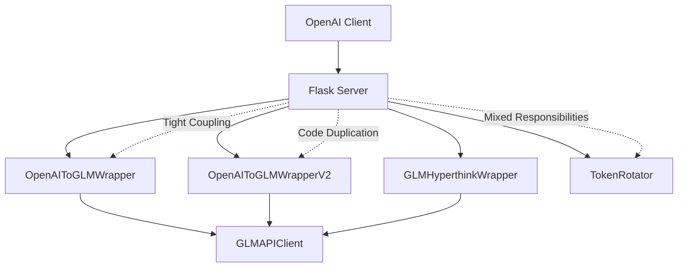
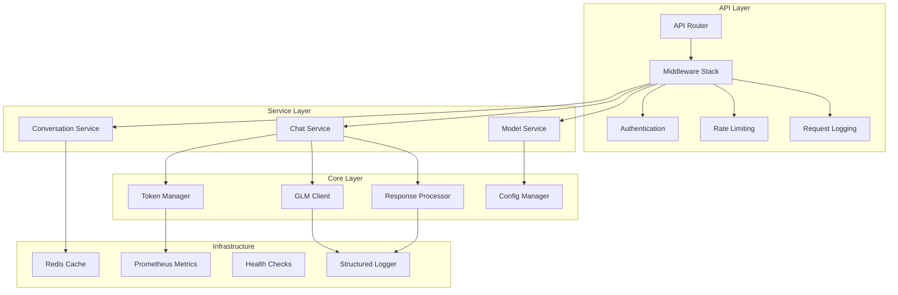
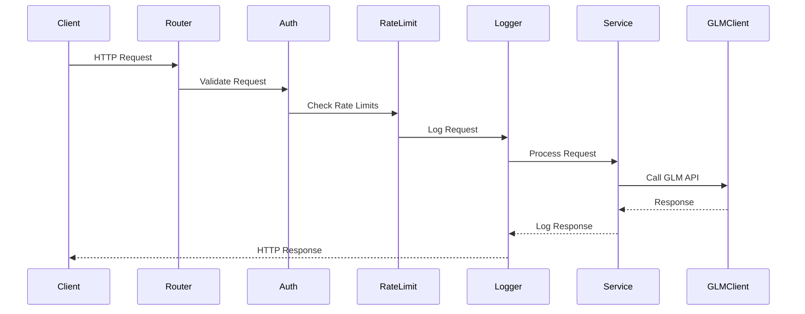
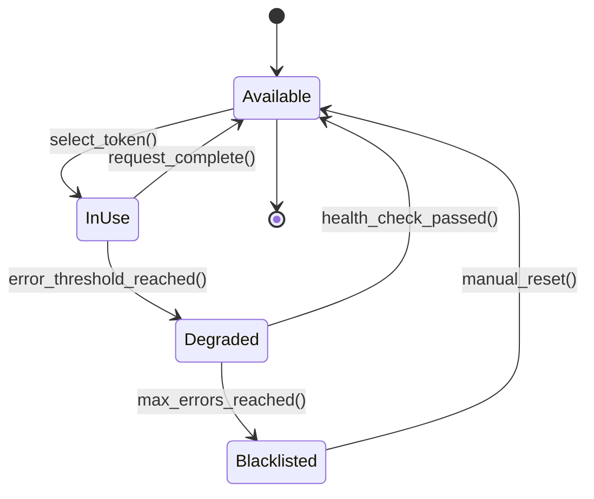
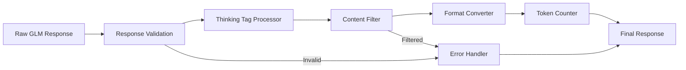
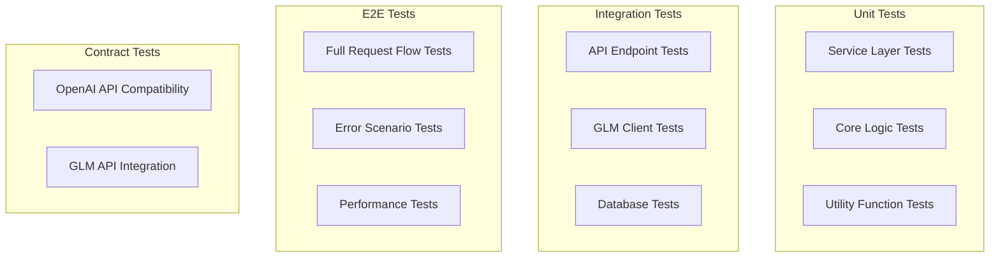
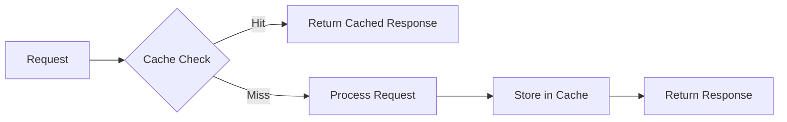

# GLM OpenAI-Compatible API Wrapper - Codebase Improvement Design

## Overview

This design document outlines comprehensive improvements for the GLM OpenAI-compatible API wrapper codebase. The current system provides OpenAI-compatible endpoints for GLM (ChatGLM) models from Zhipu AI, supporting both streaming and non-streaming responses with thinking tags.

**Current Architecture Issues Identified:**
- Lack of proper project structure and separation of concerns
- Inconsistent error handling and logging
- Missing comprehensive testing framework
- Hardcoded configurations and poor configuration management
- Limited monitoring and observability capabilities
- Code duplication across wrapper classes
- Missing dependency injection and modular design patterns

## Technology Stack & Dependencies

**Current Stack:**
- **Backend Framework:** Flask (3.1.1+)
- **HTTP Client:** requests (2.32.4+) 
- **Configuration:** python-dotenv (1.1.1+)
- **Containerization:** Docker with Docker Compose
- **Language:** Python 3.11+

**Proposed Additional Dependencies:**
- **Testing:** pytest, pytest-asyncio, pytest-mock, pytest-cov
- **Logging:** structlog, python-json-logger
- **Validation:** pydantic, marshmallow
- **Monitoring:** prometheus-client, flask-healthz
- **Code Quality:** black, isort, flake8, mypy

## Architecture

### Current Architecture Problems



### Proposed Improved Architecture



## Component Architecture

### 1. API Router & Middleware Stack

**Current State:** Monolithic Flask routes with mixed concerns
**Proposed Solution:** Layered middleware architecture



### 2. Service Layer Design

| Service | Responsibility | Input | Output |
|---------|---------------|-------|--------|
| **ChatService** | Handle chat completions | OpenAI format messages | Processed GLM responses |
| **ModelService** | Manage model configurations | Model requests | Available models list |
| **ConversationService** | Save/load conversations | Conversation data | Stored/retrieved conversations |
| **TokenService** | Manage API tokens | Token rotation requests | Active tokens |

### 3. Configuration Management

**Current Issues:**
- Environment variables mixed with hardcoded values
- No validation of configuration
- Inconsistent default values

**Proposed Configuration Schema:**

```python
# config/settings.py
@dataclass
class APIConfig:
    host: str = "0.0.0.0"
    port: int = 8976
    debug: bool = False
    workers: int = 4

@dataclass 
class GLMConfig:
    base_url: str = "https://chat.z.ai/api/chat/completions"
    timeout: int = 120
    max_retries: int = 3
    retry_delay: float = 1.0

@dataclass
class TokenConfig:
    token_file: str = "token.json"
    rotation_strategy: str = "round_robin"
    health_check_interval: int = 300

@dataclass
class LoggingConfig:
    level: str = "INFO"
    format: str = "json"
    file_path: str = "logs/glm_server.log"
    max_size: str = "100MB"
    backup_count: int = 5
```

## Core Business Logic Layer

### 1. Token Management Enhancement

**Current Problems:**
- Basic round-robin without health checking
- No token performance monitoring
- Limited error recovery

**Proposed Token Manager Architecture:**



**Token Health Metrics:**
- Request success rate (last 100 requests)
- Average response time
- Error types and frequency
- Token usage costs

### 2. Response Processing Pipeline

**Current Issues:**
- Inconsistent thinking tag handling
- No response validation
- Limited content filtering

**Proposed Response Pipeline:**



## API Endpoints Reference

### Enhanced Endpoint Structure

| Endpoint | Method | Purpose | Input Schema | Output Schema |
|----------|--------|---------|--------------|---------------|
| `/v1/chat/completions` | POST | Chat with thinking tags | `ChatCompletionRequest` | `ChatCompletionResponse` |
| `/v2/chat/completions` | POST | Chat without thinking tags | `ChatCompletionRequest` | `ChatCompletionResponse` |
| `/v1/models` | GET | List available models | None | `ModelsResponse` |
| `/v1/tokens/stats` | GET | Token usage statistics | None | `TokenStatsResponse` |
| `/v1/health` | GET | Health check | None | `HealthResponse` |
| `/v1/metrics` | GET | Prometheus metrics | None | Prometheus format |

### Request/Response Schema Validation

```python
# schemas/chat.py
class ChatMessage(BaseModel):
    role: Literal["system", "user", "assistant"]
    content: Union[str, List[Dict[str, Any]]]
    name: Optional[str] = None

class ChatCompletionRequest(BaseModel):
    model: str = "0727-360B-API"
    messages: List[ChatMessage]
    stream: bool = False
    temperature: Optional[float] = Field(None, ge=0.0, le=2.0)
    max_tokens: Optional[int] = Field(None, gt=0)
    top_p: Optional[float] = Field(None, ge=0.0, le=1.0)

class ChatCompletionResponse(BaseModel):
    id: str
    object: str
    created: int
    model: str
    choices: List[Choice]
    usage: TokenUsage
    metadata: Optional[Dict[str, Any]] = None
```

## Data Models & ORM Mapping

### Conversation Storage

```python
# models/conversation.py
class Conversation(BaseModel):
    id: str = Field(default_factory=lambda: str(uuid.uuid4()))
    created_at: datetime = Field(default_factory=datetime.utcnow)
    updated_at: datetime = Field(default_factory=datetime.utcnow)
    messages: List[ChatMessage]
    metadata: Dict[str, Any] = Field(default_factory=dict)
    token_usage: TokenUsage
    model: str
    user_id: Optional[str] = None
```

### Token Management

```python
# models/token.py  
class TokenInfo(BaseModel):
    token: str
    created_at: datetime
    last_used: datetime
    status: TokenStatus
    stats: TokenStats
    health_score: float = Field(ge=0.0, le=1.0)

class TokenStats(BaseModel):
    total_requests: int = 0
    successful_requests: int = 0
    failed_requests: int = 0
    total_input_tokens: int = 0
    total_output_tokens: int = 0
    total_cost: float = 0.0
    avg_response_time: float = 0.0
```

## Middleware & Interceptors

### Request Processing Middleware Stack

```python
# middleware/request_processing.py
class RequestValidationMiddleware:
    """Validate incoming requests against schema"""
    
class AuthenticationMiddleware:
    """Handle API key authentication"""
    
class RateLimitingMiddleware:
    """Implement per-user rate limiting"""
    
class RequestLoggingMiddleware:
    """Log all requests with correlation IDs"""
    
class MetricsMiddleware:
    """Collect Prometheus metrics"""
    
class ErrorHandlingMiddleware:
    """Centralized error handling and formatting"""
```

### Response Processing Interceptors

| Interceptor | Purpose | Order |
|-------------|---------|-------|
| **ResponseValidationInterceptor** | Validate response schema | 1 |
| **ThinkingTagInterceptor** | Process thinking tags based on API version | 2 |
| **ContentFilterInterceptor** | Filter inappropriate content | 3 |
| **TokenCountingInterceptor** | Calculate accurate token usage | 4 |
| **MetricsInterceptor** | Record response metrics | 5 |
| **ResponseLoggingInterceptor** | Log response details | 6 |

## Testing Strategy

### Test Architecture



### Test Categories

| Test Type | Coverage Target | Tools | Location |
|-----------|----------------|-------|----------|
| **Unit Tests** | 90%+ | pytest, pytest-mock | `tests/unit/` |
| **Integration Tests** | Key flows | pytest, testcontainers | `tests/integration/` |
| **Contract Tests** | API compatibility | pact, pytest | `tests/contract/` |
| **Performance Tests** | Load testing | locust, pytest-benchmark | `tests/performance/` |
| **Security Tests** | Vulnerability scanning | bandit, safety | `tests/security/` |

### Mock Strategy

```python
# tests/conftest.py
@pytest.fixture
def mock_glm_client():
    """Mock GLM API client for testing"""
    
@pytest.fixture  
def mock_token_manager():
    """Mock token manager for testing"""
    
@pytest.fixture
def sample_conversation():
    """Sample conversation data for testing"""
```

## Error Handling & Logging

### Structured Error Handling

```python
# core/exceptions.py
class GLMAPIError(Exception):
    """Base exception for GLM API errors"""
    
class TokenExhaustionError(GLMAPIError):
    """Raised when all tokens are exhausted"""
    
class ModelNotAvailableError(GLMAPIError):
    """Raised when requested model is not available"""
    
class RateLimitExceededError(GLMAPIError):
    """Raised when rate limit is exceeded"""
```

### Centralized Error Response Format

```python
# schemas/error.py
class ErrorResponse(BaseModel):
    error: ErrorDetail
    request_id: str
    timestamp: datetime

class ErrorDetail(BaseModel):
    type: str
    message: str
    code: int
    details: Optional[Dict[str, Any]] = None
```

### Structured Logging

```python
# core/logging.py
logger = structlog.get_logger()

# Usage examples:
logger.info("request_started", 
           request_id=request_id, 
           endpoint="/v1/chat/completions",
           user_id=user_id)

logger.error("glm_api_error",
            request_id=request_id,
            error_type="timeout",
            token_id=token_id,
            response_time=response_time)
```

## Performance Optimization

### Caching Strategy



### Connection Pooling

```python
# core/http_client.py
class HTTPClientPool:
    """Managed HTTP connection pool for GLM API"""
    def __init__(self):
        self.session = requests.Session()
        adapter = HTTPAdapter(
            pool_connections=20,
            pool_maxsize=20,
            max_retries=3
        )
        self.session.mount('https://', adapter)
```

### Async Processing Pipeline

```python
# core/async_processor.py
async def process_streaming_response(messages, model):
    """Async streaming response processor"""
    async with aiohttp.ClientSession() as session:
        async with session.post(url, json=payload) as response:
            async for chunk in response.content.iter_chunked(1024):
                yield process_chunk(chunk)
```

## Monitoring & Observability

### Metrics Collection

| Metric Type | Metric Name | Purpose |
|-------------|-------------|---------|
| **Counter** | `glm_requests_total{endpoint, method, status}` | Total requests processed |
| **Histogram** | `glm_request_duration_seconds{endpoint}` | Request latency distribution |
| **Gauge** | `glm_active_tokens` | Number of active tokens |
| **Counter** | `glm_token_errors_total{token_id, error_type}` | Token error count |
| **Histogram** | `glm_token_usage_cost_usd` | Token usage cost distribution |

### Health Check Implementation

```python
# health/checks.py
class HealthChecker:
    async def check_glm_api_connectivity(self) -> HealthStatus:
        """Check if GLM API is reachable"""
        
    async def check_token_availability(self) -> HealthStatus:
        """Check if valid tokens are available"""
        
    async def check_memory_usage(self) -> HealthStatus:
        """Check memory usage levels"""
        
    async def check_disk_space(self) -> HealthStatus:
        """Check available disk space"""
```

### Alerting Strategy

| Alert | Condition | Severity | Action |
|-------|-----------|----------|--------|
| **High Error Rate** | Error rate > 10% for 5 minutes | Critical | Page on-call |
| **Token Exhaustion** | Available tokens < 1 | Critical | Page on-call |
| **High Latency** | P95 latency > 10s for 5 minutes | Warning | Slack notification |
| **Memory Usage** | Memory usage > 80% | Warning | Slack notification |

## Security Enhancements

### Authentication & Authorization

```python
# security/auth.py
class APIKeyValidator:
    """Validate and manage API keys"""
    
    def validate_key(self, api_key: str) -> AuthResult:
        """Validate API key and return user context"""
        
class RoleBasedAccessControl:
    """Implement RBAC for different API endpoints"""
    
    def check_permission(self, user: User, resource: str, action: str) -> bool:
        """Check if user has permission for resource/action"""
```

### Input Sanitization

```python
# security/sanitization.py
class ContentSanitizer:
    """Sanitize user inputs and responses"""
    
    def sanitize_message_content(self, content: str) -> str:
        """Remove potentially harmful content"""
        
    def validate_model_name(self, model: str) -> bool:
        """Validate model name against whitelist"""
```

## Deployment & Infrastructure

### Docker Optimization

```dockerfile
# Multi-stage build for smaller images
FROM python:3.11-slim as builder
WORKDIR /app
COPY requirements.txt .
RUN pip wheel --no-cache-dir --no-deps --wheel-dir /app/wheels -r requirements.txt

FROM python:3.11-slim
WORKDIR /app
COPY --from=builder /app/wheels /wheels
RUN pip install --no-cache /wheels/*

# Non-root user for security
RUN adduser --disabled-password --gecos '' appuser
USER appuser

COPY --chown=appuser:appuser . .
EXPOSE 8976

HEALTHCHECK --interval=30s --timeout=10s --start-period=5s --retries=3 \
    CMD curl -f http://localhost:8976/v1/health || exit 1

CMD ["gunicorn", "--bind", "0.0.0.0:8976", "--workers", "4", "app:create_app()"]
```

### Production Configuration

```yaml
# docker-compose.prod.yml
version: '3.8'
services:
  glm-server:
    build: .
    deploy:
      replicas: 3
      resources:
        limits:
          memory: 512M
          cpus: '0.5'
        reservations:
          memory: 256M
          cpus: '0.25'
    environment:
      - FLASK_ENV=production
      - LOG_LEVEL=INFO
    volumes:
      - ./logs:/app/logs:rw
    networks:
      - glm-network
      
  nginx:
    image: nginx:alpine
    ports:
      - "80:80"
      - "443:443"
    volumes:
      - ./nginx.conf:/etc/nginx/nginx.conf:ro
    depends_on:
      - glm-server
    networks:
      - glm-network
      
  redis:
    image: redis:alpine
    volumes:
      - redis_data:/data
    networks:
      - glm-network
```

## Migration Strategy

### Phase 1: Foundation (Weeks 1-2)
- Implement project structure reorganization
- Add comprehensive logging and error handling
- Create configuration management system
- Set up testing framework

### Phase 2: Core Improvements (Weeks 3-4)  
- Refactor wrapper classes into service layer
- Implement enhanced token management
- Add request/response validation
- Create monitoring and metrics collection

### Phase 3: Advanced Features (Weeks 5-6)
- Implement caching and performance optimizations
- Add security enhancements
- Create comprehensive test suite
- Set up CI/CD pipeline

### Phase 4: Production Readiness (Weeks 7-8)
- Performance testing and optimization
- Security audit and penetration testing
- Documentation completion
- Production deployment preparation

## Code Quality Standards

### Code Formatting & Linting

```toml
# pyproject.toml
[tool.black]
line-length = 88
target-version = ['py311']

[tool.isort]
profile = "black"
multi_line_output = 3

[tool.mypy]
python_version = "3.11"
warn_return_any = true
warn_unused_configs = true
disallow_untyped_defs = true

[tool.flake8]
max-line-length = 88
extend-ignore = E203, W503
```

### Pre-commit Hooks

```yaml
# .pre-commit-config.yaml
repos:
  - repo: https://github.com/psf/black
    rev: 23.1.0
    hooks:
      - id: black
  - repo: https://github.com/pycqa/isort
    rev: 5.12.0
    hooks:
      - id: isort
  - repo: https://github.com/pycqa/flake8
    rev: 6.0.0
    hooks:
      - id: flake8
  - repo: https://github.com/pre-commit/mirrors-mypy
    rev: v1.0.1
    hooks:
      - id: mypy
```

### Documentation Standards

- **API Documentation:** OpenAPI 3.0 specification with Swagger UI
- **Code Documentation:** Google-style docstrings with type hints
- **Architecture Documentation:** Markdown with Mermaid diagrams
- **Deployment Documentation:** Step-by-step runbooks with troubleshooting guides